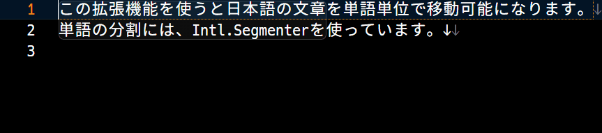
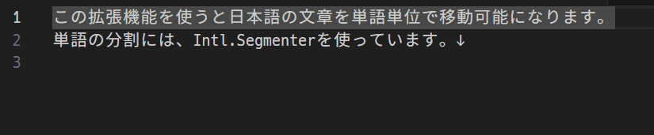

# Word Divider

Enable cursor movement in Japanese sentences on a word-by-word basis.

## Features

| Command                               | Keybinding for Windows and Linux | Keybinding for Mac | Command to be overwritten | Description                      |
| ------------------------------------- | -------------------------------- | ------------------ | ------------------------- | -------------------------------- |
| word-divider.cursorWordLeft           | `Ctrl`+`LeftArrow`               | `⌥` `←`            | cursorWordLeft            | Move cursor to the previous word |
| word-divider.cursorWordEndRight       | `Ctrl`+`RightArrow`              | `⌥` `→`            | cursorWordEndRight        | Move cursor to the next word     |
| word-divider.cursorWordLeftSelect     | `Ctrl`+`Shift`+`LeftArrow`       | `⇧` `⌥` `←`        | cursorWordLeftSelect      | Select the previous word         |
| word-divider.cursorWordEndRightSelect | `Ctrl`+`Shift`+`RightArrow`      | `⇧` `⌥` `→`        | cursorWordEndRightSelect  | Select the next word             |
| word-divider.deleteWordLeft           | `Ctrl`+`Backspace`               | `⌥` `Backspace`    | deleteWordLeft            | Remove the previous word         |
| word-divider.deleteWordEndRight       | `Ctrl`+`Delete`                  | `⌥` `Delete`       | deleteWordRight           | Remove the next word             |

## Differences from Japanese Word Handler

This extension is inspired by [sgryjp/japanese-word-handler](https://github.com/sgryjp/japanese-word-handler).

Japanese Word Handler move based on character type, while Word Divider move based on word recognition.

### Using Word Handler

### Using Japanese Word Handler

While Word Divider divides `拡張機能` into `拡張` and `機能`, and `使うと` into `使う` and `と`, we can see that the Japanese word handler treats `拡張機能` as `拡張機能` and `使うと` as `使` and `と`.

## Extension Settings

none

## Known Issues

- Cannot double click to select a word. [#50](https://github.com/yutotnh/word-divider/issues/50)
- Cannot move word by word in SOURCE CONTROL message box. [#48](https://github.com/yutotnh/word-divider/issues/48)

## Release Notes

See [CHANGELOG.md](CHANGELOG.md)
